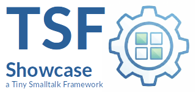

|<sub>🇬🇧 [English translation →](README.en.md)</sub>|
|----:|
|    |

|[](https://pharo.org)|[](./LICENSE) [](#)|
|----|----|
|| ***TSF-Showcase***<br>Das "Big Picture" der Tiny Smalltalk Framework (TSF) Suite|

<sup>***TSF*** steht für ***Tiny Smalltalk Framework*** — eine Sammlung von minimalistischen Tools für robuste Anwendungen.</sup>


## TSF Showcase: The Self-Maintaining Service Node

Es ist keine Library, sondern eine Referenz-Implementierung. Sie demonstriert, wie die vier spezialisierten TSF-Komponenten (**Logger, Scheduler, FileRotator, NexIO**) ineinandergreifen, um eine robuste, wartungsfreie und fernsteuerbare Server-Anwendung zu erstellen.

-----

## Das Szenario

Wir simulieren einen **"Service Node"**, der 24/7 laufen soll. Die Anforderungen an ein solches System sind typischerweise:

1.  **Transparenz:** Es muss protokollieren, was passiert (**Logger**).
2.  **Selbstheilung/Wartung:** Log-Dateien dürfen die Festplatte nicht füllen und müssen regelmäßig rotiert werden (**FileRotator** + **Scheduler**).
3.  **Fernsteuerung:** Administratoren müssen Statusabfragen machen oder Wartungsarbeiten manuell anstoßen können (**NexIO**).

## Die Architektur

Das Projekt ist in einen **Service-Knoten** (Server) und einen **Client-Knoten** (Administrationskonsole) unterteilt.

### The Service Node Layers

Der `TsfServiceNode` fungiert als Orchestrator ("Glue Code"), der die Komponenten initialisiert und verbindet.

| Layer | Komponente | Die Rolle im Showcase |
| :--- | :--- | :--- |
| **1. Communication** | **TSF-NexIO** | Der *Eingang zur Außenwelt*. Er stellt einen JSON-RPC 2.0 Server bereit. |
| **2. Control** | **TSF-Scheduler** | Der *Herzschlag*. Er triggert den RotationTask verlässlich alle 5 Minuten im Hintergrund. |
| **3. Maintenance** | **TSF-FileRotator** | Der *Hausmeister*. Ein spezialisiertes Worker-Objekt.The worker. Ein POJO das Filesizes, Rotationlogs prüft, sie zipt und archiviert (cleanup). |
| **4. Foundation** | **TSF-Logger** | Das *Gedächtnis*. Bietet threadsichere Dateiprotokollierung, die gleichzeitig von Hintergrundprozessen und Netzwerkanfragen genutzt wird. |

-----

## Feature Spotlight: Synchron auf Asynchron

### 1\. Synchrone Semantik über asynchrone Kanäle

Ein besonderes Highlight dieser Demo ist das Zusammenspiel von **TSF-NexIO** und **TSF-FileRotator**.

Wenn ein Administrator manuell eine Rotation erzwingt, geschieht Folgendes:

1.  Client sendet `forceLogRotation` via WebSocket (Asynchroner Transport).
2.  NexIO wandelt dies in einen Methodenaufruf im Delegate um (Selector: `#rpcForceLogRotation`).
3.  Das Delegate ruft `rotator execute` auf (Blockierende Operation).
4.  Erst wenn die Rotation (inkl. ZIP-Komprimierung) fertig ist, sendet NexIO die Antwort zurück.

Der Aufrufer hat das Gefühl einer lokalen, synchronen Methode, obwohl komplexe verteilte Prozesse ablaufen.

### 2\. Secure Reflection Mapping

Der `TSF-NexIO` Der Server stellt nicht alle Methoden seiner Delegaten unreflektiert zur Verfügung. Er verwendet eine sichere Mapping-Konvention, die in diesem Projekt demonstriert wird:
  * **Client sendet öffentliche Name:** z.B.: `'systemStatus'`
  * **Server mapped intern auf sichere Signatur:** `#rpcSystemStatus:params:session:`

Dies verhindert die Ausführung beliebigen Codes (z. B. durch Aufrufe von `#inspect` oder `#quit` durch Clients), und hält gleichzeitig den Dispatch-Mechanismus dynamisch und sauber, ohne dass manuelle `if/else`-Kaskaden erforderlich sind.

-----

## Getting Started

### 1\. Installation

Laden Sie das Showcase-Projekt (zieht automatisch alle Abhängigkeiten):

```smalltalk
Metacello new
    baseline: 'TsfShowcase';
    repository: 'github://georghagn/TSF-Showcase:main';
    load.
```

### 2\. Starten der Demo

Kopieren Sie das folgende Skript in einen Playground, um die gesamte Interaktion zwischen Server und Client in Aktion zu sehen.

```smalltalk
"--- TSF SHOWCASE DEMO SCRIPT ---"

"=== 1. SERVER SIDE: Start the Service Node ==="
"This initializes Logger, Scheduler, FileRotator and the NexIO Server on port 8080"
serverNode := TsfServiceNode new.
serverNode initialize; start.

"Inspect the node to see the internal state of components"
"You can also check your working directory for 'service.log'"
serverNode inspect.


"=== 2. CLIENT SIDE: Simulate an Admin Console ==="
adminClient := TsfClientNode new.
adminClient initialize.

"Connect to the server's WebSocket endpoint"
adminClient connect.


"=== 3. INTERACTION: Query Status ==="
"Client sends 'systemStatus', Server maps to 'rpcSystemStatus:params:session:'"
status := adminClient checkSystemStatus.
Transcript cr; show: 'Client received Status: ', status asString.


"=== 4. ACTION: Force Maintenance (Synchronous Wait!) ==="
"Note: The client will block here until the server has finished zipping the file."
Transcript cr; show: 'Client triggering maintenance (waiting)...'.
result := adminClient triggerMaintenance.
Transcript show: ' DONE. Result: ', result.


"=== 5. CLEANUP ==="
adminClient disconnect.
serverNode stop.
```

-----

## Über die TSF-Suite

Die **Tiny Smalltalk Frameworks** folgen der Philosophie: *Kleine, scharfe Werkzeuge statt monolithischer Blöcke.* Jedes Framework ist einzeln nutzbar, aber – wie dieses Projekt zeigt – so designed, dass sie perfekt harmonieren.

  * [TSF-Logger](https://github.com/georghagn/TSF-Logger) - Minimalistisches, Thread-safe Logging.
  * [TSF-Scheduler](https://github.com/georghagn/TSF-Scheduler) - Robustes in-image Process scheduling.
  * [TSF-FileRotator](https://github.com/georghagn/TSF-FileRotator) - Prozessunabhängige Logrotation mit Sperrfunktion.
  * [TSF-NexIO](https://github.com/georghagn/TSF-NexIO) - JSON-RPC über WebSockets mit synchronem Client

## Kontakt

Entwickelt als Proof-of-Concept für modulare Smalltalk-Architekturen.
Fragen an: *georghagn [at] tiny-frameworks.io*

